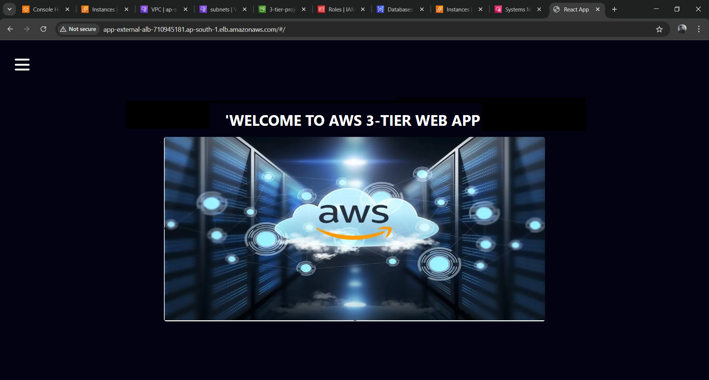
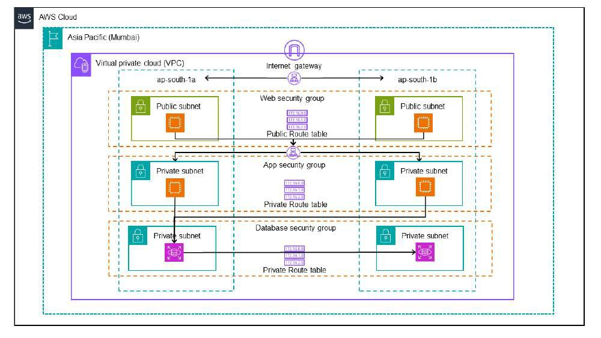
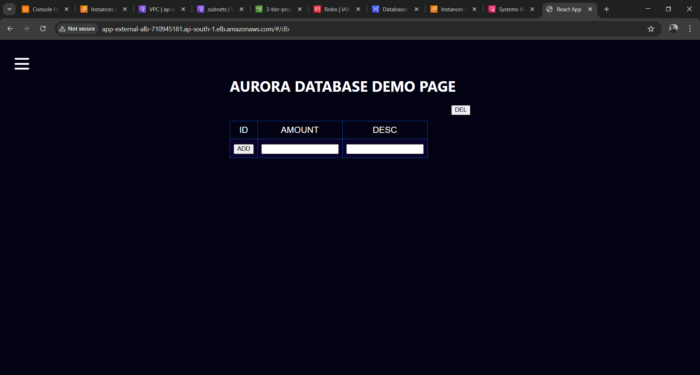

---

# 3-Tier Architecture Application on AWS

This project demonstrates how to deploy a **Highly Available 3-Tier Web Application** on AWS using services like **VPC, EC2, RDS, Load Balancers, Auto Scaling Groups, and S3**.

---



## Architecture Overview

The application is deployed in **three tiers**:

1. **Web Tier** – Public-facing Nginx + Node.js servers, behind an Internet-facing Load Balancer.
2. **Application Tier** – Node.js App Servers running in private subnets, behind an Internal Load Balancer.
3. **Database Tier** – RDS MySQL database deployed in private subnets.

Additional services:

* **S3 Bucket** for storing code.
* **IAM Role** for EC2 access & SSM Session Manager.
* **ACM** for SSL Certificates.
* **Auto Scaling Groups (ASG)** for scalability.

---


##  AWS Services Used

* **VPC** with Public & Private Subnets
* **EC2** (Web + App servers)
* **RDS MySQL**
* **S3** (Private bucket for code)
* **IAM** (Role for EC2 with SSM access)
* **Elastic Load Balancer (ALB)** – Internal + External
* **Auto Scaling Group (ASG)**
* **ACM** (SSL Certificates)
* **Route53** (Custom Domain, optional)



---

##  Deployment Steps

1. **VPC Setup**

   * CIDR: `192.168.0.0/16`
   * 2 Public Subnets (for Web)
   * 4 Private Subnets (for App + DB)
   * NAT Gateway in Public Subnet

2. **Security Groups**

   * Web ALB SG → Allow HTTP/HTTPS from `0.0.0.0/0`
   * Web SG → Allow from Web ALB SG
   * App ALB SG → Allow from Web SG
   * App SG → Allow TCP 4000 from App ALB SG
   * DB SG → Allow MySQL from App SG

3. **S3 Bucket**

   * Upload `application-code/` and `install.sh`
   * Update **App DB config** & **Web Nginx config** with correct endpoints.

4. **RDS MySQL**

   * Private subnets only (DB1, DB2)
   * Example Endpoint: `my3tierdb.cdbmlufgqkjd.ap-south-1.rds.amazonaws.com`
   * Username: `admin` | Password: `root123456`

5. **Application Tier (App Servers)**

   * Launch EC2 in private subnet.
   * Install Node.js + PM2.
   * Connect RDS and create `webappdb`.
   * Deploy code from S3.
   * Internal ALB → Health check `/health`

6. **Web Tier (Web Servers)**

   * Launch EC2 in public subnet.
   * Install Node.js + Nginx.
   * Deploy frontend from S3.
   * Configure Nginx to forward API requests to Internal ALB.

7. **External Load Balancer**

   * Internet-facing, forwards traffic to Web Servers.
   * ACM SSL Certificate for HTTPS.

8. **Auto Scaling Groups**

   * Web + App tiers configured with Launch Templates.
   * Min = 2, Max = 6, Desired = 4
   * Scaling policy = CPU > 70%

---

##  How to Access

Once deployed, open the **External Load Balancer DNS** (or custom domain via Route53 + ACM) in browser:

```
https://<your-domain-or-elb-dns>
```

---

##  Project Files

* `application-code/` → App + Web code
* `install.sh` → Installation script
* `nginx.conf` → Custom Nginx configuration
* `DbConfig.js` → RDS Database credentials

---

##  Future Enhancements

* Add **CloudFront CDN** for caching.
* Enable **Monitoring & Alerts** with CloudWatch.
* CI/CD pipeline using **CodePipeline + CodeDeploy**.

---

